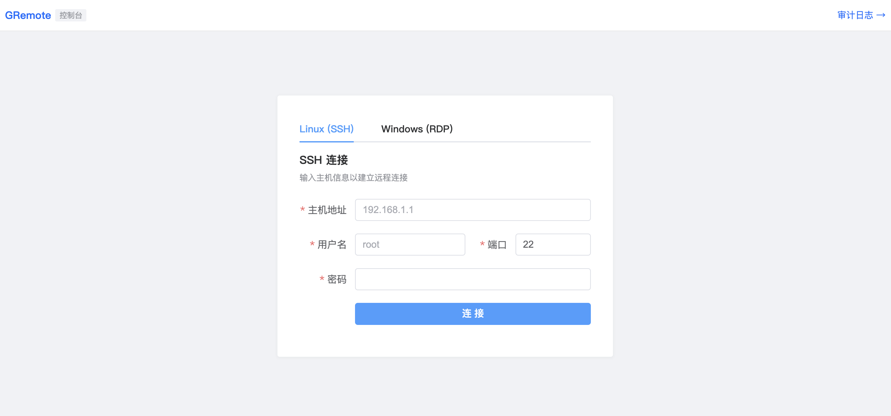
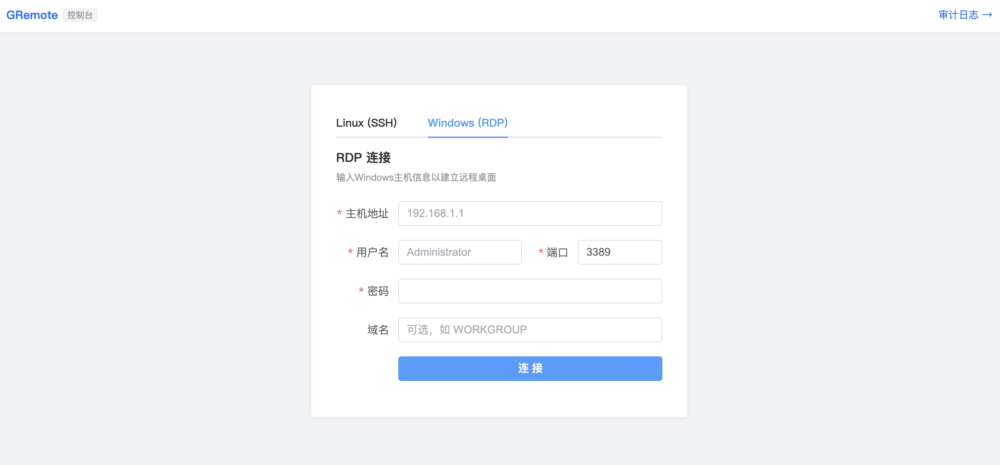
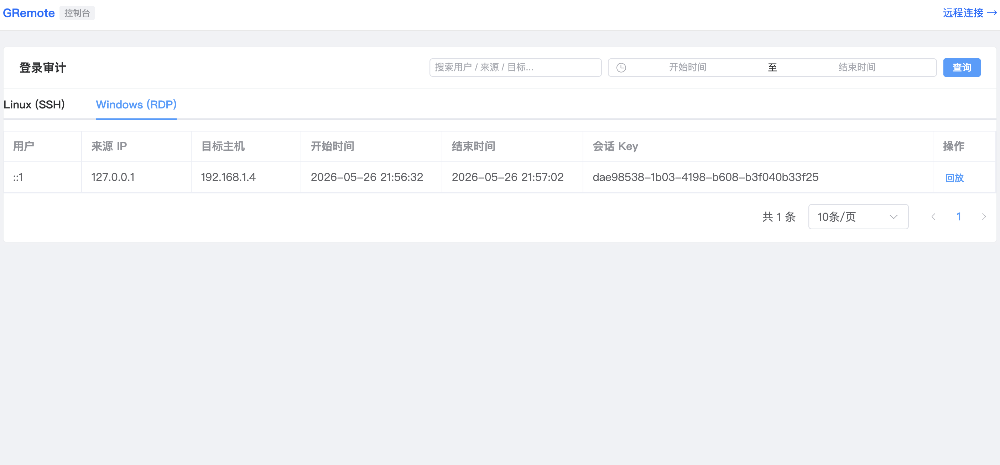
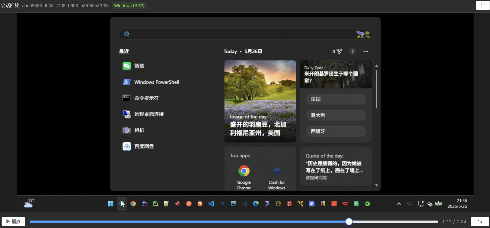

# GRemote - Web 终端连接系统

基于 Go + Vue 3 的 Web SSH/RDP 终端，支持文件传输、操作审计和会话回放。

## 功能特性

- **Web SSH 终端**：基于 xterm.js，支持多主题（暗色、亮色、日光、德古拉）、全屏显示
- **Windows RDP 远程桌面**：基于 Apache Guacamole，支持 RDP 协议连接 Windows 机器
- **文件管理**：通过 SFTP 实现文件浏览、上传、下载
- **操作审计**：自动记录每次 SSH/RDP 登录，支持来源 IP、用户、目标主机等查询
- **会话回放**：终端操作录制与回放，SSH 基于 asciinema 格式，RDP 基于 .guac 格式
- **会话管理**：通过 Redis 临时存储会话密钥，支持配置过期时间
- **Docker 一键部署**：提供 docker-compose 完整编排

---

## 页面展示

### SSH 连接



### RDP 连接



### 回放列表

| Linux | Windows |
|-------|---------|
|  |  |

### 录像回放

| Linux | Windows |
|-------|---------|
|  |  |

---

## 技术架构

| 层级 | 技术栈 |
|------|--------|
| 前端 | Vue 3 + TypeScript + Element Plus + xterm.js + guacamole-common-js + Vite |
| 后端 | Go + Gin + WebSocket + SFTP + Guacamole Protocol |
| 存储 | Redis（会话密钥）、Elasticsearch（审计日志）、MinIO/S3（录制文件） |
| 部署 | Docker + Nginx 反向代理 |

---

## 快速开始

### Docker 部署（推荐）

#### 前置条件

- Docker 和 Docker Compose 已安装

#### 第一步：克隆项目

```bash
git clone https://github.com/chuanqidota/gremote.git
cd gremote
```

#### 第二步：创建环境配置文件

```bash
cp .env.example .env
```

`.env` 文件包含所有服务的配置，默认值可直接使用，后续可根据需要修改。

#### 第三步：启动基础设施

```bash
docker compose up -d minio redis elasticsearch guacd
```

启动后等待所有容器就绪（约 10-30 秒），可用以下命令检查：

```bash
docker compose ps
```

#### 第四步：配置 MinIO

1. 打开 MinIO 控制台：http://localhost:9001
2. 使用默认账号登录：`minioadmin` / `minioadmin`
3. 点击 **Access Keys** → **Create Access Key**，记录 AccessKey 和 SecretKey
4. 点击 **Buckets** → **Create Bucket**，名称填写 `gremote`

#### 第五步：填写 MinIO 凭证到 .env

将第四步获取的 AccessKey 和 SecretKey 填入 `.env`：

```bash
MINIO_ACCESS_KEY=你的AccessKey
MINIO_SECRET_KEY=你的SecretKey
MINIO_BUCKET=gremote
```

> 如果使用 MinIO 默认的 `minioadmin/minioadmin`，可跳过此步。

#### 第六步：启动应用

```bash
docker compose up -d
```

#### 第七步：访问

- 前端页面：http://localhost
- MinIO 控制台：http://localhost:9001
- Elasticsearch：http://localhost:9200

#### 常用命令

```bash
# 查看所有容器状态
docker compose ps

# 查看后端日志
docker compose logs -f backend

# 重启后端（修改配置后）
docker compose up -d --build backend

# 停止所有服务
docker compose down

# 停止并删除数据卷（清空数据）
docker compose down -v
```

### 手动部署

**后端：**

```bash
cd backend

# 修改配置
vim config/config.yaml

# 编译运行
go build -o gremote .
./gremote
```

**前端：**

```bash
cd frontend

# 安装依赖
npm install

# 开发模式（端口 5173）
npm run dev

# 生产构建
npm run build
```

---

## 部署配置

### 本地开发

配置文件：`backend/config/config.yaml`

```yaml
Server:
  Host: 0.0.0.0                # 服务监听地址
  Port: 8000                   # 服务端口
  SessionTTL: 86400            # 会话密钥过期时间（秒），默认24小时
  ReadTimeout: 60              # HTTP 读超时（秒）
  WriteTimeout: 60             # HTTP 写超时（秒）
  ShutdownTimeout: 5           # 优雅关闭超时（秒）
  InsecureSkipVerify: true     # 跳过 SSH 主机密钥验证

Redis:
  Addr: 127.0.0.1:6379         # Redis 地址
  Password: ""                 # Redis 密码
  DB: 0                        # Redis 数据库编号

ElasticSearch:
  Url: http://127.0.0.1:9200   # ES 地址
  Username: ""                 # ES 用户名
  Password: ""                 # ES 密码

Audit:
  LoginAuditIndex: gremote-login   # 登录审计索引前缀
  RecordAuditIndex: gremote-record # 操作审计索引前缀

S3:
  Endpoint: 127.0.0.1:9000     # MinIO 地址
  AccessKeyID: xxx              # MinIO AccessKey
  SecretAccessKey: xxx          # MinIO SecretKey
  UseSSL: false                 # 是否使用 HTTPS
  Bucket: gremote               # 桶名

Guacd:
  Host: 127.0.0.1              # guacd 地址
  Port: 4822                    # guacd 端口
  RecordingPath: /tmp/recordings  # 本地录像存储路径
  GuacdPath: /recordings       # guacd 容器内录像路径
  DefaultWidth: 1024            # RDP 默认窗口宽度
  DefaultHeight: 768            # RDP 默认窗口高度
  DefaultDPI: 96               # RDP 默认 DPI
  SessionTimeout: 86400         # guacd 会话超时（秒），默认24小时
  GuacSizeThreshold: 52428800   # 触发自动转MP4的.guac文件大小阈值（字节），默认50MB

GuacWorker:
  URL: http://127.0.0.1:8081   # guac 录像转换服务地址
  Timeout: 300                  # 转换超时（秒）

Logger:
  Filename: ./log/gremote.log  # 日志文件路径
  MaxSize: 10                  # 单个日志文件最大大小（MB）
  MaxBackups: 5                # 最多保留日志文件数
  MaxAge: 7                    # 日志文件最大保留天数

Display:
  DisplayMode: all             # 页面显示模式：all | linux | windows
```

### Docker 部署

Docker 部署通过挂载 `config.yaml` 管理配置。直接修改项目中的 `backend/config/config.yaml`，重启后端容器即可生效：

```bash
# 修改配置后重启后端
docker compose up -d --build backend
```

> 后端支持 `GREMOTE_*` 环境变量覆盖 config.yaml 中的同名配置（通过 viper），适用于 K8s 等场景通过 ConfigMap/Secret 注入配置。

---

## 外部系统接入指南

GRemote 提供完整的 REST API，外部系统可通过调用 API 获取会话密钥，再跳转到 Web 终端页面完成 SSH 连接。

### 接入流程

```
外部系统                GRemote Backend              GRemote Frontend
   │                          │                           │
   │  ① POST /obtain-key      │                           │
   │ ────────────────────────>│                           │
   │  返回 key                 │                           │
   │ <────────────────────────│                           │
   │                          │                           │
   │  ② 打开新窗口            │                           │
   │  window.open(...)        │                           │
   │ ────────────────────────────────────────────────────>│
   │                          │   ③ 建立 WebSocket 连接   │
   │                          │ <─────────────────────────│
   │                          │   ④ 创建 SSH 会话         │
   │                          │                           │
```

### Step 1：获取会话密钥

```bash
POST http://your-host/api/v1/obtain-key
Content-Type: application/json

{
  "target": "192.168.1.100",
  "username": "root",
  "password": "your-password",
  "port": 22,
  "user": "operator-name",    # 可选，用于审计记录
  "source": "operator-ip"     # 可选，用于审计记录
}
```

**响应：**

```json
{
  "code": 1,
  "msg": "ok",
  "key": "a1b2c3d4e5f6..."
}
```

> 密钥有效期由 `SessionTTL` 配置控制，默认 24 小时。每个密钥仅可使用一次，连接后即失效。

### Step 2：打开 Web 终端

在前端页面（生产环境为 nginx）中打开新窗口：

```javascript
const key = "从 Step 1 获取的密钥"
window.open(`/term?key=${key}`, '_blank')
```

> 首次连接时可传递 `host` 参数显示目标主机 IP：`/term?key=${key}&host=192.168.1.100`

### 接入示例

**JavaScript (SSH)：**

```javascript
async function connectSSH(target, username, password) {
  const res = await fetch('/api/v1/obtain-key', {
    method: 'POST',
    headers: { 'Content-Type': 'application/json' },
    body: JSON.stringify({ target, username, password, port: 22 })
  })
  const { key } = await res.json()
  window.open(`/term?key=${key}`, '_blank')
}

// 调用
connectSSH('192.168.1.100', 'root', 'mypassword')
```

**JavaScript (RDP)：**

```javascript
async function connectRDP(target, username, password, domain) {
  const res = await fetch('/api/v1/obtain-key-rdp', {
    method: 'POST',
    headers: { 'Content-Type': 'application/json' },
    body: JSON.stringify({ target, username, password, port: 3389, domain })
  })
  const { key } = await res.json()
  window.open(`/rdp?key=${key}&host=${target}`, '_blank')
}

// 调用
connectRDP('192.168.1.100', 'Administrator', 'mypassword', 'WORKGROUP')
```

**Python (SSH)：**

```python
import requests

resp = requests.post('http://your-host/api/v1/obtain-key', json={
    'target': '192.168.1.100',
    'username': 'root',
    'password': 'mypassword',
    'port': 22,
})
key = resp.json()['key']
print(f'打开终端: http://your-host/term?key={key}')
```

**Python (RDP)：**

```python
import requests

resp = requests.post('http://your-host/api/v1/obtain-key-rdp', json={
    'target': '192.168.1.100',
    'username': 'Administrator',
    'password': 'mypassword',
    'port': 3389,
    'domain': 'WORKGROUP',
})
key = resp.json()['key']
print(f'打开远程桌面: http://your-host/rdp?key={key}&host=192.168.1.100')
```

---

## API 参考

所有接口前缀：`/api/v1`

### REST API

| 方法 | 路径 | 说明 | 参数 |
|------|------|------|------|
| POST | `/obtain-key` | 获取 SSH 会话密钥 | Body: `target, username, password, port, user?, source?` |
| POST | `/obtain-key-rdp` | 获取 RDP 会话密钥 | Body: `target, username, password, port, domain?` |
| GET | `/list-file` | 浏览目录文件 | Query: `key, path` |
| POST | `/upload-file` | 上传文件 | Form: `file` + Query: `key, path` |
| GET | `/download-file` | 下载文件 | Query: `key, path, filename` |
| GET | `/login-audit` | 查询登录审计 | Query: `offset, limit, search, startTime, endTime` |
| GET | `/record-url` | 获取回放地址 | Query: `key` |
| GET | `/record-file` | 获取录制文件 | Query: `key` |
| GET | `/record-file-guac` | 获取 RDP 录制文件内容(.guac) | Query: `key` |
| GET | `/record-file-size` | 获取 .guac 文件大小及是否需要转换 | Query: `key` |
| GET | `/list-guac-files` | 列出 S3 中所有 .guac 录制文件 | — |
| POST | `/convert-guac` | 触发 .guac 转 MP4 异步任务 | Query: `key` |
| GET | `/convert-status` | 查询 MP4 转换状态 | Query: `key` |
| GET | `/record-file-mp4` | 获取转换后的 MP4 录制文件 | Query: `key` |

### WebSocket

| 协议 | 路径 | 说明 |
|------|------|------|
| WS | `/ws/v1/:key` | SSH 终端连接，连接后发送 `{ "resize": [cols, rows] }` |
| WS | `/ws/v1/rdp/:key` | RDP 远程桌面连接，连接后发送 `{ "width": N, "height": N }` |

### 响应格式

```json
// 成功
{ "code": 1, "msg": "执行成功", "data": "..." }

// 失败
{ "code": -1, "msg": "错误信息" }
```

---

## 目录结构

```
gremote/
├── backend/                  # Go 后端
│   ├── cmd/                  # 启动入口
│   ├── app/
│   │   ├── api/              # REST 接口
│   │   │   ├── params/       # 请求参数定义
│   │   │   └── view/         # 接口处理
│   │   └── ws/               # WebSocket 处理
│   │       ├── view/         # WS 处理器 (SSH + RDP)
│   │       └── utils/
│   │           ├── loginAudit/   # 登录审计
│   │           ├── recordAudit/  # 操作审计
│   │           └── asciinema/    # 录制工具
│   ├── config/               # 配置文件
│   ├── pkg/                  # 通用工具包
│   │   ├── es/               # Elasticsearch
│   │   ├── redis/            # Redis
│   │   ├── s3/               # MinIO/S3
│   │   ├── guacamole/        # Guacamole 协议客户端
│   │   ├── terminal/         # SSH 终端
│   │   ├── file/             # SFTP 文件
│   │   ├── logger/           # 日志
│   │   └── middleware/       # 中间件
│   └── go.mod
├── frontend/                 # Vue 3 前端
│   ├── src/
│   │   ├── pages/            # 页面
│   │   │   ├── ConnectPage.vue   # 连接页 (SSH + RDP)
│   │   │   ├── TerminalPage.vue  # SSH 终端页
│   │   │   ├── RdpPage.vue       # RDP 远程桌面页
│   │   │   ├── AuditPage.vue     # 审计日志
│   │   │   └── PlaybackPage.vue  # 会话回放
│   │   ├── components/       # 组件
│   │   ├── composables/      # 组合式函数
│   │   │   ├── useRdpWebSocket.ts # RDP WebSocket 管理
│   │   │   └── ...
│   │   ├── api/              # API 封装
│   │   └── types/            # 类型定义
│   └── nginx.conf            # Nginx 配置
├── guac-worker/              # Guacamole 录像转换服务
├── docker-compose.yaml
└── README.md
```

---

## RDP 录像回放流程

RDP 会话录像以 `.guac` 格式存储在 MinIO 中，key 为 `<session-key>.guac`。回放时前端按以下流程自动选择播放方式：

```
用户打开回放页面
       │
       ▼
  ① MP4 已存在？ ──── 是 ──→ 直接播放 MP4（HTML5 <video>）
       │ 否
       ▼
  ② .guac 文件 < 50MB？ ── 是 ──→ 原生播放 .guac（guacamole-common-js）
       │ 否
       ▼
  ③ 触发异步转换 → 轮询等待（每3秒，最长10分钟）→ 播放 MP4
       │
     转换失败/超时？
       │
       ▼
  ④ 用户可选择"使用原始格式播放"回退到 .guac
```

### 原生播放（.guac）

基于 guacamole-common-js 的 `SessionRecording`，支持播放、暂停、跳转和倍速（0.5x / 1x / 2x / 4x / 8x）。适合小文件，无需转换等待。

### MP4 播放

基于 HTML5 `<video>` 标签，使用浏览器原生播放控件。适合大文件，由 guac-worker 异步转换生成。

### guac-worker 转换服务

guac-worker 是独立的 Go HTTP 服务，负责将 `.guac` 录像转换为浏览器兼容的 MP4。

**转换流程：** `.guac` → guacenc → `.m4v` → ffmpeg (H.264) → `.mp4` → 上传 S3

**转换 API：**

| 方法 | 路径 | 说明 |
|------|------|------|
| POST | `/convert` | 接收转换请求，Body: `{"key": "<key>"}` |
| GET | `/health` | 健康检查 |

**相关配置：**

```yaml
GuacWorker:
  URL: http://127.0.0.1:8081   # guac-worker 服务地址
  Timeout: 300                  # HTTP 客户端超时（秒）

# guac-worker 自身配置（guac-worker/config.yaml）
convert_timeout: 600            # 每个转换步骤超时（秒），默认10分钟
```

> guac-worker 默认监听 8080 端口，docker-compose 中映射为宿主机 8081 端口。转换依赖 guacenc 和 ffmpeg 工具，已内置在 guac-worker 镜像中。

---

## 常见问题

**Q: 密钥过期后无法连接？**
调用 `/obtain-key` 获取新密钥，过期时间由 `Server.SessionTTL` 控制。

**Q: Elasticsearch 未启动会怎样？**
终端仍可正常使用，仅审计日志和操作回放功能不可用。

**Q: 如何修改终端主题？**
连接后在工具栏下拉框中选择暗色/亮色/日光/德古拉。

**Q: 如何修改会话过期时间？**
修改 `backend/config/config.yaml` 中 `Server.SessionTTL`（单位：秒）。

**Q: Windows RDP 连接失败？**
1. 确认 guacd 服务已启动：`docker compose ps guacd`
2. 确认目标 Windows 机器已开启 RDP 服务
3. 检查防火墙是否允许 3389 端口
4. 确认用户名密码正确，域用户需填写域名

**Q: RDP 录像文件在哪里？**
RDP 会话录像以 `.guac` 格式存储在 MinIO 中，文件名为 `{session-key}.guac`。

**Q: RDP 录像回放时为什么会自动转换为 MP4？**
当 `.guac` 录像文件大小超过 `Guacd.GuacSizeThreshold`（默认 50MB）时，前端会自动触发异步转换任务将 `.guac` 转为 MP4 格式播放，以获得更好的回放体验。转换过程通过轮询 `/convert-status` 接口跟踪进度，转换完成后自动播放 MP4。若转换失败或超时，可选择使用原始 `.guac` 格式播放。阈值可在配置文件中调整。

**Q: guacd 容器启动失败？**
1. 检查端口 4822 是否被占用：`lsof -i :4822`
2. 查看容器日志：`docker compose logs guacd`
3. ARM 架构电脑可能需要使用模拟运行，性能会有所下降

**Q: 如何配置 guacd 连接？**
修改 `backend/config/config.yaml` 中的 `Guacd` 配置：
```yaml
Guacd:
  Host: 127.0.0.1  # guacd 地址，Docker 部署使用 guacd
  Port: 4822       # guacd 端口
```
