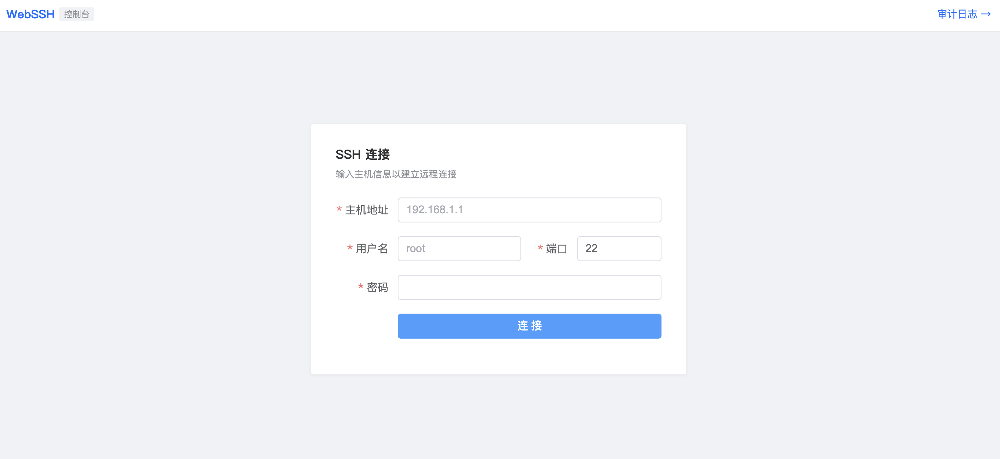
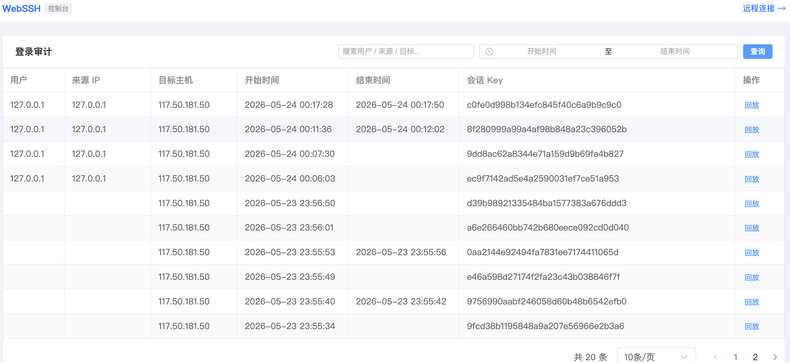
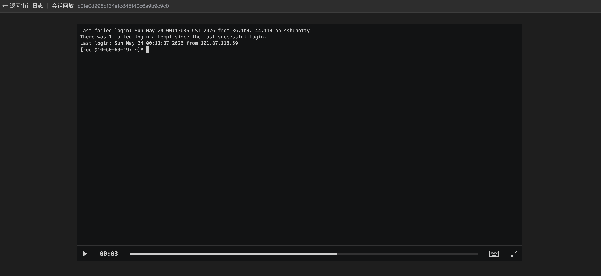

# GWebSSH - Web 终端连接系统

基于 Go + Vue 3 的 Web SSH 终端，支持文件传输、操作审计和会话回放。

## 功能特性

- **Web 终端**：基于 xterm.js，支持多主题（暗色、亮色、日光、德古拉）、全屏显示
- **文件管理**：通过 SFTP 实现文件浏览、上传、下载
- **操作审计**：自动记录每次 SSH 登录，支持来源 IP、用户、目标主机等查询
- **会话回放**：终端操作录制与回放，基于 asciinema 格式
- **会话管理**：通过 Redis 临时存储会话密钥，支持配置过期时间
- **Docker 一键部署**：提供 docker-compose 完整编排

## 页面展示

### 连接页面


### 审计日志


### 操作回放


---

## 技术架构

| 层级 | 技术栈 |
|------|--------|
| 前端 | Vue 3 + TypeScript + Element Plus + xterm.js + Vite |
| 后端 | Go + Gin + WebSocket + SFTP |
| 存储 | Redis（会话密钥）、Elasticsearch（审计日志）、MinIO/S3（录制文件） |
| 部署 | Docker + Nginx 反向代理 |

---

## 快速开始

### Docker 部署（推荐）

#### 前置条件

- Docker 和 Docker Compose 已安装

#### 第一步：克隆项目

```bash
git clone https://github.com/chuanqidota/gwebssh.git
cd gwebssh
```

#### 第二步：创建环境配置文件

```bash
cp .env.example .env
```

`.env` 文件包含所有服务的配置，默认值可直接使用，后续可根据需要修改。

#### 第三步：启动基础设施

```bash
docker-compose up -d minio redis elasticsearch
```

启动后等待所有容器就绪（约 10-30 秒），可用以下命令检查：

```bash
docker-compose ps
```

#### 第四步：配置 MinIO

1. 打开 MinIO 控制台：http://localhost:9001
2. 使用默认账号登录：`minioadmin` / `minioadmin`
3. 点击 **Access Keys** → **Create Access Key**，记录 AccessKey 和 SecretKey
4. 点击 **Buckets** → **Create Bucket**，名称填写 `gwebssh`

#### 第五步：填写 MinIO 凭证到 .env

将第四步获取的 AccessKey 和 SecretKey 填入 `.env`：

```bash
MINIO_ACCESS_KEY=你的AccessKey
MINIO_SECRET_KEY=你的SecretKey
MINIO_BUCKET=gwebssh
```

> 如果使用 MinIO 默认的 `minioadmin/minioadmin`，可跳过此步。

#### 第六步：启动应用

```bash
docker-compose up -d
```

#### 第七步：访问

- 前端页面：http://localhost
- MinIO 控制台：http://localhost:9001
- Elasticsearch：http://localhost:9200

#### 常用命令

```bash
# 查看所有容器状态
docker-compose ps

# 查看后端日志
docker-compose logs -f backend

# 重启后端（修改配置后）
docker-compose up -d --build backend

# 停止所有服务
docker-compose down

# 停止并删除数据卷（清空数据）
docker-compose down -v
```

### 手动部署

**后端：**

```bash
cd backend

# 修改配置
vim config/config.yaml

# 编译运行
go build -o gwebssh .
./gwebssh
```

**前端：**

```bash
cd frontend

# 安装依赖
npm install

# 开发模式（端口 5173）
npm run dev

# 生产构建
npm run build
```

---

## 部署配置

### 本地开发

配置文件：`backend/config/config.yaml`

```yaml
Server:
  Host: 0.0.0.0              # 服务监听地址
  Port: 8000                 # 服务端口
  SessionTTL: 86400          # 会话密钥过期时间（秒），默认24小时
  InsecureSkipVerify: true   # 跳过SSH主机密钥验证

Redis:
  Addr: 127.0.0.1:6379       # Redis 地址
  Password: ""               # Redis 密码
  DB: 0                      # Redis 数据库编号

ElasticSearch:
  Url: http://127.0.0.1:9200 # ES 地址
  Username: ""               # ES 用户名
  Password: ""               # ES 密码

Audit:
  LoginAuditIndex: gwebssh-login   # 登录审计索引前缀
  RecordAuditIndex: gwebssh-record # 操作审计索引前缀

S3:
  Endpoint: 127.0.0.1:9000   # MinIO 地址
  AccessKeyID: xxx            # MinIO AccessKey
  SecretAccessKey: xxx        # MinIO SecretKey
  UseSSL: false               # 是否使用 HTTPS
  Bucket: gwebssh             # 桶名
```

### Docker 部署

Docker 部署通过 `.env` 文件管理配置，环境变量会覆盖 `config.yaml` 中的值：

| 环境变量 | 说明 | 默认值 |
|---------|------|--------|
| `GWEBSSH_SERVER_PORT` | 服务端口 | 8000 |
| `GWEBSSH_REDIS_ADDR` | Redis 地址 | redis:6379 |
| `GWEBSSH_ELASTICSEARCH_URL` | ES 地址 | http://elasticsearch:9200 |
| `GWEBSSH_S3_ENDPOINT` | MinIO 地址 | minio:9000 |
| `GWEBSSH_S3_ACCESSKEYID` | MinIO AccessKey | minioadmin |
| `GWEBSSH_S3_SECRETACCESSKEY` | MinIO SecretKey | minioadmin |
| `GWEBSSH_S3_BUCKET` | 桶名 | gwebssh |

> 配置优先级：环境变量 > config.yaml

---

## 外部系统接入指南

GWebSSH 提供完整的 REST API，外部系统可通过调用 API 获取会话密钥，再跳转到 Web 终端页面完成 SSH 连接。

### 接入流程

```
外部系统                GWebSSH Backend              GWebSSH Frontend
   │                          │                           │
   │  ① POST /obtain-key      │                           │
   │ ────────────────────────>│                           │
   │  返回 key                 │                           │
   │ <────────────────────────│                           │
   │                          │                           │
   │  ② 打开新窗口            │                           │
   │  window.open(...)        │                           │
   │ ────────────────────────────────────────────────────>│
   │                          │   ③ 建立 WebSocket 连接   │
   │                          │ <─────────────────────────│
   │                          │   ④ 创建 SSH 会话         │
   │                          │                           │
```

### Step 1：获取会话密钥

```bash
POST http://your-host/api/v1/obtain-key
Content-Type: application/json

{
  "target": "192.168.1.100",
  "username": "root",
  "password": "your-password",
  "port": 22,
  "user": "operator-name",    # 可选，用于审计记录
  "source": "operator-ip"     # 可选，用于审计记录
}
```

**响应：**

```json
{
  "code": 1,
  "msg": "ok",
  "key": "a1b2c3d4e5f6..."
}
```

> 密钥有效期由 `SessionTTL` 配置控制，默认 24 小时。每个密钥仅可使用一次，连接后即失效。

### Step 2：打开 Web 终端

在前端页面（生产环境为 nginx）中打开新窗口：

```javascript
const key = "从 Step 1 获取的密钥"
window.open(`/term?key=${key}`, '_blank')
```

> 首次连接时可传递 `host` 参数显示目标主机 IP：`/term?key=${key}&host=192.168.1.100`

### 接入示例

**JavaScript：**

```javascript
async function connectSSH(target, username, password) {
  const res = await fetch('/api/v1/obtain-key', {
    method: 'POST',
    headers: { 'Content-Type': 'application/json' },
    body: JSON.stringify({ target, username, password, port: 22 })
  })
  const { key } = await res.json()
  window.open(`/term?key=${key}`, '_blank')
}

// 调用
connectSSH('192.168.1.100', 'root', 'mypassword')
```

**Python：**

```python
import requests

resp = requests.post('http://your-host/api/v1/obtain-key', json={
    'target': '192.168.1.100',
    'username': 'root',
    'password': 'mypassword',
    'port': 22,
})
key = resp.json()['key']
print(f'打开终端: http://your-host/term?key={key}')
```

---

## API 参考

所有接口前缀：`/api/v1`

### REST API

| 方法 | 路径 | 说明 | 参数 |
|------|------|------|------|
| POST | `/obtain-key` | 获取会话密钥 | Body: `target, username, password, port, user?, source?` |
| GET | `/list-file` | 浏览目录文件 | Query: `key, path` |
| POST | `/upload-file` | 上传文件 | Form: `file` + Query: `key, path` |
| GET | `/download-file` | 下载文件 | Query: `key, path, filename` |
| GET | `/login-audit` | 查询登录审计 | Query: `offset, limit, search, startTime, endTime` |
| GET | `/record-url` | 获取回放地址 | Query: `key` |
| GET | `/record-file` | 获取录制文件 | Query: `key` |

### WebSocket

| 协议 | 路径 | 说明 |
|------|------|------|
| WS | `/ws/v1/:key` | 终端连接，连接后发送 `{ "resize": [cols, rows] }` |

### 响应格式

```json
// 成功
{ "code": 1, "msg": "执行成功", "data": "..." }

// 失败
{ "code": -1, "msg": "错误信息" }
```

---

## 目录结构

```
gwebssh/
├── backend/                  # Go 后端
│   ├── cmd/                  # 启动入口
│   ├── app/
│   │   ├── api/              # REST 接口
│   │   │   ├── params/       # 请求参数定义
│   │   │   └── view/         # 接口处理
│   │   └── ws/               # WebSocket 处理
│   │       ├── view/         # WS 处理器
│   │       └── utils/
│   │           ├── loginAudit/   # 登录审计
│   │           ├── recordAudit/  # 操作审计
│   │           └── asciinema/    # 录制工具
│   ├── config/               # 配置文件
│   ├── pkg/                  # 通用工具包
│   │   ├── es/               # Elasticsearch
│   │   ├── redis/            # Redis
│   │   ├── s3/               # MinIO/S3
│   │   ├── terminal/         # SSH 终端
│   │   ├── file/             # SFTP 文件
│   │   ├── logger/           # 日志
│   │   └── middleware/       # 中间件
│   └── go.mod
├── frontend/                 # Vue 3 前端
│   ├── src/
│   │   ├── pages/            # 页面
│   │   │   ├── ConnectPage.vue   # 连接页
│   │   │   ├── TerminalPage.vue  # 终端页
│   │   │   ├── AuditPage.vue     # 审计日志
│   │   │   └── PlaybackPage.vue  # 会话回放
│   │   ├── components/       # 组件
│   │   ├── composables/      # 组合式函数
│   │   ├── api/              # API 封装
│   │   └── types/            # 类型定义
│   └── nginx.conf            # Nginx 配置
├── docker-compose.yaml
└── README.md
```

---

## 常见问题

**Q: 密钥过期后无法连接？**
调用 `/obtain-key` 获取新密钥，过期时间由 `Server.SessionTTL` 控制。

**Q: Elasticsearch 未启动会怎样？**
终端仍可正常使用，仅审计日志和操作回放功能不可用。

**Q: 如何修改终端主题？**
连接后在工具栏下拉框中选择暗色/亮色/日光/德古拉。

**Q: 如何修改会话过期时间？**
修改 `backend/config/config.yaml` 中 `Server.SessionTTL`（单位：秒）。
