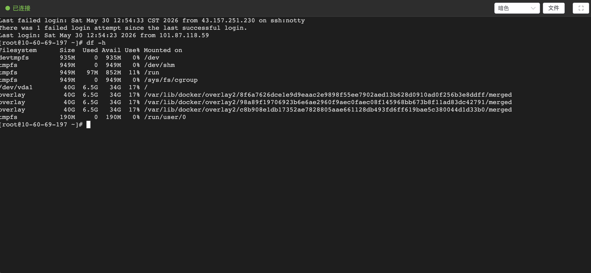
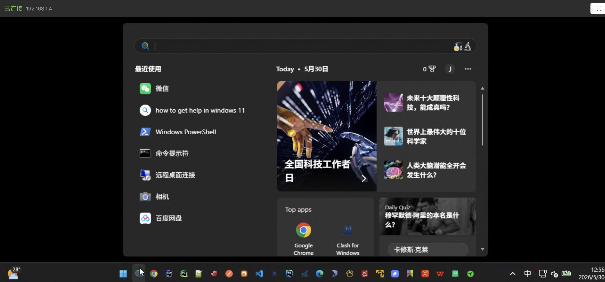
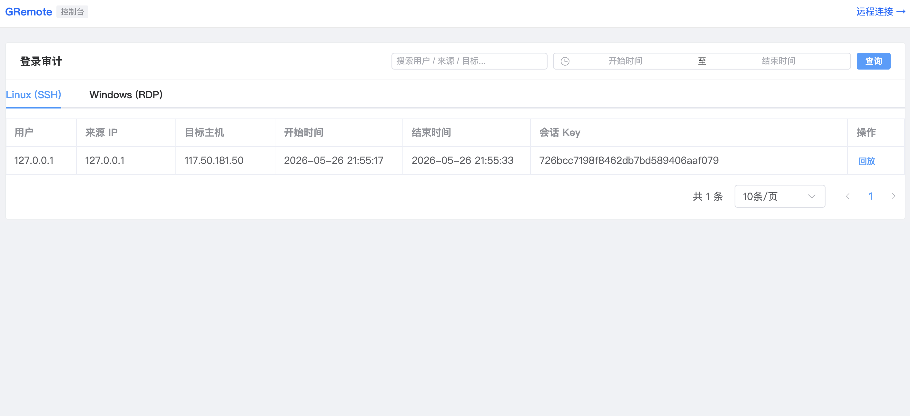
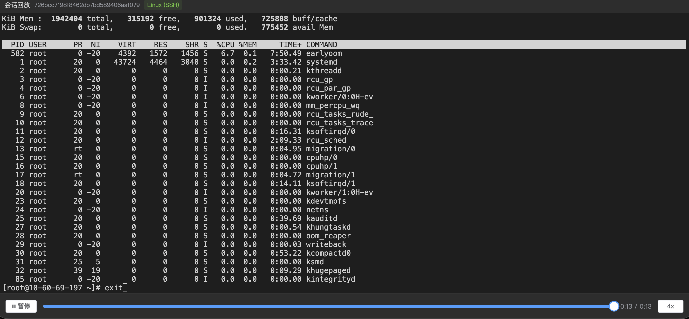

# GRemote - Web 终端连接系统

基于 Go + Vue 3 的 Web SSH/RDP 终端，支持文件传输、操作审计和会话回放。

## 功能特性

- **Web SSH 终端**：基于 xterm.js，支持多主题（暗色、亮色、日光、德古拉）、全屏显示
- **Windows RDP 远程桌面**：基于 Apache Guacamole，支持 RDP 协议连接 Windows 机器
- **文件管理**：通过 SFTP 实现文件浏览、上传、下载
- **操作审计**：自动记录每次 SSH/RDP 登录，支持来源 IP、用户、目标主机等查询
- **会话回放**：终端操作录制与回放，SSH 基于 asciinema 格式，RDP 基于 MP4 格式
- **会话管理**：通过 Redis 临时存储会话密钥，一次一密，支持配置过期时间
- **Docker 一键部署**：提供 docker-compose 完整编排

---

## 页面展示

### SSH / RDP 连接

| Linux | Windows |
|-------|---------|
|  |  |

### 远程桌面

| Linux | Windows |
|-------|---------|
|  |  |

### 回放列表

| Linux | Windows |
|-------|---------|
|  |  |

### 录像回放

| Linux | Windows |
|-------|---------|
|  |  |

---

## 技术架构

| 层级 | 技术栈 |
|------|--------|
| 前端 | Vue 3 + TypeScript + Element Plus + xterm.js + guacamole-common-js + Vite |
| 后端 | Go + Gin + WebSocket + SFTP + Guacamole Protocol |
| 存储 | Redis（会话密钥）、Elasticsearch（审计日志）、MinIO/S3（录制文件） |
| 部署 | Docker + Nginx 反向代理 |

---

## 工作原理

### 整体数据流

```
浏览器 (Vue 3 SPA)
    │
    ├── REST API (/api/v1/*) ──→ 后端 (Go/Gin) ──→ Redis（会话密钥）
    │                                            ──→ Elasticsearch（审计日志）
    │                                            ──→ MinIO/S3（录制文件、SFTP 临时文件）
    │                                            ──→ SSH/SFTP（远程服务器）
    │
    ├── WebSocket (/ws/v1/:key) ──→ 后端 ──→ SSH 会话（终端 I/O）
    ├── WebSocket (/ws/v1/rdp/:key) ──→ 后端 ──→ guacd（Guacamole 协议）
    │                                                        │
    │                                                   guac-worker（MP4 转换服务）
    │
    Nginx（生产环境反向代理：静态文件 + /api + /ws）
```

---

### 阶段一：会话密钥获取

用户在前端填写连接信息后，系统并不直接建立 SSH/RDP 连接，而是先通过 REST API 获取一个**一次性会话密钥**。

**SSH 密钥获取流程：**

1. 前端调用 `POST /api/v1/obtain-key`，提交 `target`、`username`、`password`、`port` 等参数
2. 后端生成 UUID 作为密钥（去除横杠），将连接信息 JSON 序列化后存入 Redis，设置 TTL（默认 24 小时，由 `Server.SessionTTL` 控制）
3. 返回密钥给前端，前端通过 `window.open(`/term?key=${key}`)` 打开新标签页

**RDP 密钥获取流程：**

1. 前端调用 `POST /api/v1/obtain-key-rdp`，额外支持 `domain` 参数
2. 后端同样生成 UUID 密钥，存入 Redis，自动填充 `source` 为客户端 IP
3. 前端打开 `/rdp?key=${key}&host={target}`

**密钥设计要点：**

- **一次性使用**：每个密钥只能连接一次。通过 Redis `SetNX` 命令在连接时设置 `{key}_connected` 标记键，如果已存在则拒绝连接
- **自动过期**：密钥和连接标记键共享相同的 TTL，过期后自动清理
- **安全分离**：连接凭证仅存储在 Redis 中，不暴露给前端，前端只持有密钥

---

### 阶段二：SSH 终端连接

密钥获取后，前端在新标签页中通过 WebSocket 建立 SSH 终端会话。

**连接建立过程：**

```
浏览器                          后端                           远程服务器
  │                              │                               │
  │ ① WebSocket 连接             │                               │
  │ /ws/v1/:key                  │                               │
  │ ────────────────────────────→│                               │
  │                              │ ② 验证密钥                    │
  │                              │ - 检查 Redis 中是否存在        │
  │                              │ - SetNX 标记已连接（一次性）    │
  │                              │                               │
  │ ③ 发送窗口大小               │                               │
  │ {"resize":[cols,rows]}       │                               │
  │ ────────────────────────────→│                               │
  │                              │ ④ 建立 SSH 连接               │
  │                              │ ssh.Dial(target:port)         │
  │                              │ ─────────────────────────────→│
  │                              │                               │
  │                              │ ⑤ 请求 PTY + 启动 Shell       │
  │                              │ session.RequestPty("xterm")   │
  │                              │ session.Shell()               │
  │                              │ ─────────────────────────────→│
  │                              │                               │
  │ ⑥ 双向数据流                 │                               │
  │ ←───────────────────────────→│←─────────────────────────────→│
  │   (WebSocket)                │   (SSH Session)               │
```

**核心协程模型：**

连接建立后，后端启动三个 goroutine 和一个等待协程，通过 `quitChan`（容量为 4 的 channel）协调生命周期：

| 协程 | 职责 | 数据流向 |
|------|------|----------|
| `ReceiveWsMsg` | 读取 WebSocket 消息，写入 SSH stdin | 浏览器 → 远程服务器 |
| `WriteWsMsg` | 读取 SSH stdout/stderr，写入 WebSocket 和 ES channel | 远程服务器 → 浏览器 + ES |
| `WriteEsData` | 从 ES channel 读取数据，写入 Elasticsearch | 终端输出 → 审计记录 |
| `SessionWait` | 等待 SSH 会话结束或 WebSocket 断开 | 生命周期管理 |

**`ReceiveWsMsg` 工作细节：**

- 循环读取 WebSocket 消息
- 如果消息是 JSON 且包含 `resize` 字段，调用 `session.WindowChange()` 调整终端大小
- 否则将原始字节写入 SSH stdin pipe（用户输入的按键）

**`WriteWsMsg` 工作细节：**

- 以 10ms 间隔轮询 `ComboOutput` 缓冲区（SSH stdout + stderr 合并写入）
- 将数据写入 WebSocket 发送给浏览器
- 同时非阻塞地写入 `esDataChan`（channel 容量 1024），避免 ES 写入慢时阻塞终端输出

**`WriteEsData` 工作细节：**

- 从 `esDataChan` 读取数据
- 按 asciinema v2 格式封装为 `[相对秒数, "o", 输出内容]` 写入 Elasticsearch
- 每条记录包含 `key`、`timeStamp`、`history` 字段

**会话结束处理：**

- 任一方向断开（WebSocket 关闭或 SSH 会话结束）都会通过 `quitChan` 通知所有协程退出
- `defer redis.DeleteKey(key)`：删除 Redis 中的密钥和连接标记
- `defer e.UpdateEndTime(key)`：更新 ES 中审计记录的结束时间
- `defer client.Close()`：关闭 SSH 连接

---

### 阶段三：RDP 远程桌面连接

RDP 连接通过 Apache Guacamole 协议实现，浏览器端使用 `guacamole-common-js`，后端通过 TCP 连接 `guacd` 守护进程。

**Guacamole 协议握手过程：**

```
浏览器 (guacamole-common-js)     后端                         guacd
  │                              │                              │
  │ ① WebSocket 连接             │                              │
  │ /ws/v1/rdp/:key              │                              │
  │ ────────────────────────────→│                              │
  │                              │ ② TCP 连接                   │
  │                              │ net.Dial(guacd:4822)         │
  │                              │ ────────────────────────────→│
  │                              │                              │
  │                              │ ③ select rdp                 │
  │                              │ ────────────────────────────→│
  │                              │                              │
  │                              │ ④ 读取 args 响应             │
  │                              │ ←────────────────────────────│
  │                              │ (协议版本 + 参数名列表)        │
  │                              │                              │
  │                              │ ⑤ 发送客户端能力              │
  │                              │ size, audio, video, image    │
  │                              │ ────────────────────────────→│
  │                              │                              │
  │                              │ ⑥ 发送 connect（含所有参数）   │
  │                              │ hostname, port, username,    │
  │                              │ password, recording-path...  │
  │                              │ ────────────────────────────→│
  │                              │                              │
  │                              │ ⑦ 读取 ready 响应            │
  │                              │ ←────────────────────────────│
  │                              │                              │
  │ ⑧ 双向 Guacamole 指令        │                              │
  │ ←───────────────────────────→│←────────────────────────────→│
```

**Guacamole 协议格式：**

每条指令格式为 `长度.字段1,长度.字段2,...,长度.字段N;`，例如：
- `4.size,3.1024,2.768,2.96;` → 设置窗口大小 1024x768，DPI 96
- `6.select,3.rdp;` → 选择 RDP 协议

**桥接协程模型：**

| 协程 | 职责 |
|------|------|
| WebSocket → guacd | 读取浏览器发送的 Guacamole 指令，解析后转发给 guacd |
| guacd → WebSocket | 读取 guacd 响应，编码后转发给浏览器 |

guacd → WebSocket 协程使用 10 秒读取超时，如果超时则发送 `nop` 心跳（`3.nop;`），防止浏览器在 guacd 建立 RDP 连接期间因隧道超时而断开。

**RDP 录制机制：**

- 握手时通过 `recording-path` 参数告知 guacd 录制文件路径
- guacd 自动将会话录制为 `.guac` 格式文件（Guacamole 原生指令流）
- 会话结束后，后端先关闭 guacd 连接（触发录制数据刷写到磁盘），然后等待录制文件出现（最多重试 30 次，每次间隔 1 秒），最后上传到 MinIO

---

### 阶段四：SFTP 文件管理

在 SSH 会话活跃期间，用户可以通过前端的文件管理器浏览、上传、下载远程服务器文件。

**工作原理：**

- 前端通过 REST API 发起 SFTP 操作，后端复用 Redis 中存储的 SSH 凭证建立 SFTP 连接
- `GET /api/v1/list-file?key={key}&path={path}`：列出目录内容
- `POST /api/v1/upload-file?key={key}&path={path}`：上传文件（multipart form）
- `GET /api/v1/download-file?key={key}&path={path}&filename={name}`：下载文件

**安全措施：**

- 路径遍历防护：使用 `filepath.Clean("/" + path)` 规范化路径，防止 `../../` 攻击
- 复用会话密钥：SFTP 操作依赖有效的 SSH 会话密钥，密钥过期或已断开则无法操作

---

### 阶段五：操作审计

系统自动记录所有 SSH/RDP 连接的审计信息，存储在 Elasticsearch 中。

**审计数据模型：**

**登录审计（`gremote-login-YYYY-MM`）：**

| 字段 | 说明 |
|------|------|
| `key` | 会话密钥 |
| `user` | 操作用户（外部系统传入，默认为客户端 IP） |
| `source` | 来源 IP |
| `target` | 目标主机 |
| `protocol` | 协议类型（ssh/rdp） |
| `startTime` | 连接开始时间 |
| `endTime` | 连接结束时间（会话结束后更新） |

**操作审计（`gremote-record-YYYY-MM`）：**

| 字段 | 说明 |
|------|------|
| `key` | 会话密钥 |
| `timeStamp` | 事件时间戳（毫秒） |
| `history` | asciinema v2 格式的事件数据 |

**按月分区：** 索引名包含年月后缀（如 `gremote-login-2024-01`），自动创建索引和 mapping。

---

### 阶段六：会话回放

#### SSH 回放（asciinema 格式）

**录制过程：**

1. SSH 连接建立时，写入 asciinema v2 头部信息（版本、窗口大小、时间戳、环境变量）
2. 每次终端输出时，写入 `[相对秒数, "o", 输出内容]` 格式的事件到 Elasticsearch

**回放过程：**

1. 前端调用 `GET /api/v1/record-url?key={key}`
2. 后端从 Elasticsearch 读取该会话的所有事件记录
3. 按顺序拼接为完整的 asciinema v2 文本文件
4. 上传到 MinIO（key 为原始会话 key）
5. 返回 MinIO 文件 URL
6. 前端下载 asciinema 文件，解析头部和事件列表
7. 使用 xterm.js 渲染终端，按时间间隔逐条回放事件
8. 支持播放/暂停、拖拽跳转、0.5x/1x/2x/4x/8x 倍速

#### RDP 回放（MP4 格式）

**录制过程：**

1. guacd 在 RDP 会话期间自动录制，生成 `.guac` 格式文件（Guacamole 原生指令流）
2. 会话结束后，后端将 `.guac` 文件上传到 MinIO

**转换流程：**

所有 RDP 录像统一转换为 MP4 后播放，由 guac-worker 独立服务执行：

```
用户打开回放页面
       │
       ▼
  MP4 已存在？ ──── 是 ──→ 直接播放 MP4
       │ 否
       ▼
  触发转换 → 展示进度 → 播放 MP4
       │
     转换失败？
       │
       ▼
  显示错误信息 + 重试按钮
```

**guac-worker 转换步骤：**

| 步骤 | 操作 | 工具 | 说明 |
|------|------|------|------|
| downloading | 从 S3 下载 `.guac` 文件 | MinIO SDK | 下载到临时目录 |
| encoding | 将 `.guac` 编码为 `.m4v` | `guacenc` | Guacamole 官方编码工具 |
| remuxing | 将 `.m4v` 转码为 H.264 MP4 | `ffmpeg` | `-c:v libx264 -pix_fmt yuv420p -movflags +faststart` |
| uploading | 将 MP4 上传到 S3 | MinIO SDK | key 为 `{session-key}.mp4` |

**前端轮询机制：**

1. 前端调用 `POST /api/v1/convert-guac?key={key}` 触发转换
2. 每 3 秒轮询 `GET /api/v1/convert-status?key={key}` 查询进度
3. 响应包含 `step`（当前步骤）和 `progress`（百分比）
4. 转换完成后，前端创建 `<video>` 元素播放 MP4

**防重复转换：**

- 后端使用 `sync.Map` 记录正在进行的转换任务
- guac-worker 同样检查是否已有同 key 的转换在进行
- 转换前先检查 MP4 是否已存在于 S3

---

### 阶段七：显示模式配置

系统支持通过配置控制前端页面显示的协议类型。

| 模式 | 说明 |
|------|------|
| `all` | 同时显示 SSH 和 RDP 选项卡（默认） |
| `linux` | 仅显示 SSH 选项卡 |
| `windows` | 仅显示 RDP 选项卡 |

前端通过 `GET /api/v1/config` 获取 `display_mode`，在连接页和审计页动态控制选项卡显隐。

---

## 快速开始

### Docker 部署（推荐）

#### 前置条件

- Docker 和 Docker Compose 已安装

#### 第一步：克隆项目

```bash
git clone https://github.com/chuanqidota/gremote.git
cd gremote
```

#### 第二步：创建环境配置文件

```bash
cp .env.example .env
```

`.env` 文件包含所有服务的配置，默认值可直接使用，后续可根据需要修改。

#### 第三步：启动基础设施

```bash
docker compose up -d minio redis elasticsearch guacd
```

启动后等待所有容器就绪（约 10-30 秒），可用以下命令检查：

```bash
docker compose ps
```

#### 第四步：配置 MinIO

1. 打开 MinIO 控制台：http://localhost:9001
2. 使用默认账号登录：`minioadmin` / `minioadmin`
3. 点击 **Access Keys** → **Create Access Key**，记录 AccessKey 和 SecretKey
4. 点击 **Buckets** → **Create Bucket**，名称填写 `gremote`

#### 第五步：填写 MinIO 凭证到 .env

将第四步获取的 AccessKey 和 SecretKey 填入 `.env`：

```bash
MINIO_ACCESS_KEY=你的AccessKey
MINIO_SECRET_KEY=你的SecretKey
MINIO_BUCKET=gremote
```

> 如果使用 MinIO 默认的 `minioadmin/minioadmin`，可跳过此步。

#### 第六步：启动应用

```bash
docker compose up -d
```

#### 第七步：访问

- 前端页面：http://localhost
- MinIO 控制台：http://localhost:9001
- Elasticsearch：http://localhost:9200

#### 常用命令

```bash
# 查看所有容器状态
docker compose ps

# 查看后端日志
docker compose logs -f backend

# 重启后端（修改配置后）
docker compose up -d --build backend

# 停止所有服务
docker compose down

# 停止并删除数据卷（清空数据）
docker compose down -v
```

### 手动部署

**后端：**

```bash
cd backend

# 修改配置
vim config/config.yaml

# 编译运行
go build -o gremote .
./gremote
```

**前端：**

```bash
cd frontend

# 安装依赖
npm install

# 开发模式（端口 5173）
npm run dev

# 生产构建
npm run build
```

---

## 部署配置

### 本地开发

配置文件：`backend/config/config.yaml`

```yaml
Server:
  Host: 0.0.0.0                # 服务监听地址
  Port: 8000                   # 服务端口
  SessionTTL: 86400            # 会话密钥过期时间（秒），默认24小时
  ReadTimeout: 60              # HTTP 读超时（秒）
  WriteTimeout: 60             # HTTP 写超时（秒）
  ShutdownTimeout: 5           # 优雅关闭超时（秒）
  InsecureSkipVerify: true     # 跳过 SSH 主机密钥验证

Redis:
  Addr: 127.0.0.1:6379         # Redis 地址
  Password: ""                 # Redis 密码
  DB: 0                        # Redis 数据库编号

ElasticSearch:
  Url: http://127.0.0.1:9200   # ES 地址
  Username: ""                 # ES 用户名
  Password: ""                 # ES 密码

Audit:
  LoginAuditIndex: gremote-login   # 登录审计索引前缀
  RecordAuditIndex: gremote-record # 操作审计索引前缀

S3:
  Endpoint: 127.0.0.1:9000     # MinIO 地址
  AccessKeyID: xxx              # MinIO AccessKey
  SecretAccessKey: xxx          # MinIO SecretKey
  UseSSL: false                 # 是否使用 HTTPS
  Bucket: gremote               # 桶名

Guacd:
  Host: 127.0.0.1              # guacd 地址
  Port: 4822                    # guacd 端口
  RecordingPath: /tmp/recordings  # 本地录像存储路径
  GuacdPath: /recordings       # guacd 容器内录像路径
  DefaultWidth: 1024            # RDP 默认窗口宽度
  DefaultHeight: 768            # RDP 默认窗口高度
  DefaultDPI: 96               # RDP 默认 DPI
  SessionTimeout: 86400         # guacd 会话超时（秒），默认24小时

GuacWorker:
  URL: http://127.0.0.1:8081   # guac 录像转换服务地址
  Timeout: 300                  # 转换超时（秒）

Logger:
  Filename: ./log/gremote.log  # 日志文件路径
  MaxSize: 10                  # 单个日志文件最大大小（MB）
  MaxBackups: 5                # 最多保留日志文件数
  MaxAge: 7                    # 日志文件最大保留天数

Display:
  DisplayMode: all             # 页面显示模式：all | linux | windows
```

### Docker 部署

Docker 部署通过挂载 `config.yaml` 管理配置。直接修改项目中的 `backend/config/config.yaml`，重启后端容器即可生效：

```bash
# 修改配置后重启后端
docker compose up -d --build backend
```

> 后端支持 `GREMOTE_*` 环境变量覆盖 config.yaml 中的同名配置（通过 viper），适用于 K8s 等场景通过 ConfigMap/Secret 注入配置。

---

## 外部系统接入指南

GRemote 提供完整的 REST API，外部系统可通过调用 API 获取会话密钥，再跳转到 Web 终端页面完成连接。

### 接入流程

```
外部系统                GRemote Backend              GRemote Frontend
   │                          │                           │
   │  ① POST /obtain-key      │                           │
   │ ────────────────────────>│                           │
   │  返回 key                 │                           │
   │ <────────────────────────│                           │
   │                          │                           │
   │  ② 打开新窗口            │                           │
   │  window.open(...)        │                           │
   │ ────────────────────────────────────────────────────>│
   │                          │   ③ 建立 WebSocket 连接   │
   │                          │ <─────────────────────────│
   │                          │   ④ 创建 SSH/RDP 会话     │
   │                          │                           │
```

### Step 1：获取会话密钥

```bash
POST http://your-host/api/v1/obtain-key
Content-Type: application/json

{
  "target": "192.168.1.100",
  "username": "root",
  "password": "your-password",
  "port": 22,
  "user": "operator-name",    # 可选，用于审计记录
  "source": "operator-ip"     # 可选，用于审计记录
}
```

**响应：**

```json
{
  "code": 1,
  "msg": "ok",
  "key": "a1b2c3d4e5f6..."
}
```

> 密钥有效期由 `SessionTTL` 配置控制，默认 24 小时。每个密钥仅可使用一次，连接后即失效。

### Step 2：打开 Web 终端

在前端页面（生产环境为 nginx）中打开新窗口：

```javascript
const key = "从 Step 1 获取的密钥"
window.open(`/term?key=${key}`, '_blank')
```

> 首次连接时可传递 `host` 参数显示目标主机 IP：`/term?key=${key}&host=192.168.1.100`

### 接入示例

**JavaScript (SSH)：**

```javascript
async function connectSSH(target, username, password) {
  const res = await fetch('/api/v1/obtain-key', {
    method: 'POST',
    headers: { 'Content-Type': 'application/json' },
    body: JSON.stringify({ target, username, password, port: 22 })
  })
  const { key } = await res.json()
  window.open(`/term?key=${key}`, '_blank')
}

// 调用
connectSSH('192.168.1.100', 'root', 'mypassword')
```

**JavaScript (RDP)：**

```javascript
async function connectRDP(target, username, password, domain) {
  const res = await fetch('/api/v1/obtain-key-rdp', {
    method: 'POST',
    headers: { 'Content-Type': 'application/json' },
    body: JSON.stringify({ target, username, password, port: 3389, domain })
  })
  const { key } = await res.json()
  window.open(`/rdp?key=${key}&host=${target}`, '_blank')
}

// 调用
connectRDP('192.168.1.100', 'Administrator', 'mypassword', 'WORKGROUP')
```

**Python (SSH)：**

```python
import requests

resp = requests.post('http://your-host/api/v1/obtain-key', json={
    'target': '192.168.1.100',
    'username': 'root',
    'password': 'mypassword',
    'port': 22,
})
key = resp.json()['key']
print(f'打开终端: http://your-host/term?key={key}')
```

**Python (RDP)：**

```python
import requests

resp = requests.post('http://your-host/api/v1/obtain-key-rdp', json={
    'target': '192.168.1.100',
    'username': 'Administrator',
    'password': 'mypassword',
    'port': 3389,
    'domain': 'WORKGROUP',
})
key = resp.json()['key']
print(f'打开远程桌面: http://your-host/rdp?key={key}&host=192.168.1.100')
```

---

## API 参考

所有接口前缀：`/api/v1`

### REST API

| 方法 | 路径 | 说明 | 参数 |
|------|------|------|------|
| POST | `/obtain-key` | 获取 SSH 会话密钥 | Body: `target, username, password, port, user?, source?` |
| POST | `/obtain-key-rdp` | 获取 RDP 会话密钥 | Body: `target, username, password, port, domain?` |
| GET | `/list-file` | 浏览目录文件 | Query: `key, path` |
| POST | `/upload-file` | 上传文件 | Form: `file` + Query: `key, path` |
| GET | `/download-file` | 下载文件 | Query: `key, path, filename` |
| GET | `/login-audit` | 查询登录审计 | Query: `offset, limit, search, startTime, endTime` |
| GET | `/record-url` | 获取 SSH 回放地址 | Query: `key` |
| GET | `/record-file` | 获取 SSH 录制文件内容(asciinema) | Query: `key` |
| GET | `/record-file-guac` | 获取 RDP 录制文件内容(.guac) | Query: `key` |
| GET | `/list-guac-files` | 列出 S3 中所有 .guac 录制文件 | — |
| POST | `/convert-guac` | 触发 .guac 转 MP4 异步任务 | Query: `key` |
| GET | `/convert-status` | 查询 MP4 转换状态 | Query: `key` |
| GET | `/record-file-mp4` | 获取转换后的 MP4 录制文件 | Query: `key` |
| GET | `/config` | 获取前端显示配置 | — |

### WebSocket

| 协议 | 路径 | 说明 |
|------|------|------|
| WS | `/ws/v1/:key` | SSH 终端连接，连接后发送 `{ "resize": [cols, rows] }` |
| WS | `/ws/v1/rdp/:key` | RDP 远程桌面连接，连接后发送 `{ "width": N, "height": N }` |

### 响应格式

```json
// 成功
{ "code": 1, "msg": "执行成功", "data": "..." }

// 失败
{ "code": -1, "msg": "错误信息" }
```

---

## guac-worker 转换服务

guac-worker 是独立的 Go HTTP 服务，负责将 `.guac` 录像转换为浏览器兼容的 MP4。

**API：**

| 方法 | 路径 | 说明 |
|------|------|------|
| POST | `/convert` | 接收转换请求，Body: `{"key": "<key>"}` |
| GET | `/progress?key=xxx` | 查询转换进度 |
| GET | `/health` | 健康检查 |

**相关配置：**

```yaml
GuacWorker:
  URL: http://127.0.0.1:8081   # guac-worker 服务地址
  Timeout: 300                  # HTTP 客户端超时（秒）

# guac-worker 自身配置（guac-worker/config.yaml）
convert_timeout: 600            # 每个转换步骤超时（秒），默认10分钟
```

> guac-worker 默认监听 8080 端口，docker-compose 中映射为宿主机 8081 端口。转换依赖 guacenc 和 ffmpeg 工具，已内置在 guac-worker 镜像中。

---

## 目录结构

```
gremote/
├── backend/                  # Go 后端
│   ├── cmd/                  # 启动入口（Cobra CLI）
│   ├── app/
│   │   ├── api/              # REST 接口
│   │   │   ├── params/       # 请求参数定义
│   │   │   └── handler/      # 接口处理（api.go + convert.go）
│   │   ├── ws/               # WebSocket 处理
│   │   │   └── handler/      # WS 处理器 (ssh.go + rdp.go)
│   │   └── audit/            # 审计模块
│   │       ├── esAudit/      # ES 审计基类（自动建索引）
│   │       ├── loginAudit/   # 登录审计
│   │       └── recordAudit/  # 操作审计
│   ├── config/               # 配置文件
│   ├── pkg/                  # 通用工具包
│   │   ├── elasticsearch/    # Elasticsearch 客户端
│   │   ├── redis/            # Redis 客户端
│   │   ├── minio/            # MinIO/S3 客户端
│   │   ├── guacamole/        # Guacamole 协议客户端（client.go + protocol.go）
│   │   ├── terminal/         # SSH 终端管理
│   │   ├── sftp/             # SFTP 文件传输
│   │   ├── asciinema/        # asciinema v2 格式写入
│   │   ├── response/         # 统一响应
│   │   ├── logger/           # 日志
│   │   └── middleware/       # 中间件（CORS）
│   ├── router/               # 路由注册
│   └── go.mod
├── frontend/                 # Vue 3 前端
│   ├── src/
│   │   ├── pages/            # 页面
│   │   │   ├── ConnectPage.vue   # 连接页 (SSH + RDP)
│   │   │   ├── TerminalPage.vue  # SSH 终端页
│   │   │   ├── RdpPage.vue       # RDP 远程桌面页
│   │   │   ├── AuditPage.vue     # 审计日志
│   │   │   └── PlaybackPage.vue  # 会话回放
│   │   ├── components/       # 组件
│   │   ├── composables/      # 组合式函数
│   │   │   ├── useWebSocket.ts   # WebSocket 管理
│   │   │   ├── useFileManager.ts # 文件管理
│   │   │   ├── useAudit.ts       # 审计查询
│   │   │   └── useGuacPlayback.ts # Guac 回放
│   │   ├── api/              # API 封装
│   │   └── types/            # 类型定义
│   ├── vite.config.ts        # Vite 配置（含 API/WS 代理）
│   ├── nginx.conf            # Nginx 配置（生产环境反向代理）
│   └── Dockerfile
├── guac-worker/              # Guacamole 录像转换服务
│   ├── main.go               # Gin HTTP 服务入口
│   ├── handler.go            # 转换流水线（S3→guacenc→ffmpeg→S3）
│   ├── config.yaml           # S3 连接配置
│   └── Dockerfile
├── docker-compose.yaml       # 完整编排（7 个服务）
├── .env.example              # 环境变量模板
└── README.md
```

---

## 常见问题

**Q: 密钥过期后无法连接？**
调用 `/obtain-key` 获取新密钥，过期时间由 `Server.SessionTTL` 控制。

**Q: Elasticsearch 未启动会怎样？**
终端仍可正常使用，仅审计日志和操作回放功能不可用。

**Q: 如何修改终端主题？**
连接后在工具栏下拉框中选择暗色/亮色/日光/德古拉。

**Q: 如何修改会话过期时间？**
修改 `backend/config/config.yaml` 中 `Server.SessionTTL`（单位：秒）。

**Q: Windows RDP 连接失败？**
1. 确认 guacd 服务已启动：`docker compose ps guacd`
2. 确认目标 Windows 机器已开启 RDP 服务
3. 检查防火墙是否允许 3389 端口
4. 确认用户名密码正确，域用户需填写域名

**Q: RDP 录像文件在哪里？**
RDP 会话录像以 `.guac` 格式存储在 MinIO 中，文件名为 `{session-key}.guac`。

**Q: RDP 录像回放时显示转换进度？**
所有 RDP 录像统一转换为 MP4 格式播放。首次打开回放时会自动触发转换，页面展示转换进度（下载→编码→转码→上传）。转换依赖 guac-worker 服务，请确保该服务正常运行。若转换失败，可点击重试。

**Q: guacd 容器启动失败？**
1. 检查端口 4822 是否被占用：`lsof -i :4822`
2. 查看容器日志：`docker compose logs guacd`
3. ARM 架构电脑可能需要使用模拟运行，性能会有所下降

**Q: 如何配置 guacd 连接？**
修改 `backend/config/config.yaml` 中的 `Guacd` 配置：
```yaml
Guacd:
  Host: 127.0.0.1  # guacd 地址，Docker 部署使用 guacd
  Port: 4822       # guacd 端口
```
